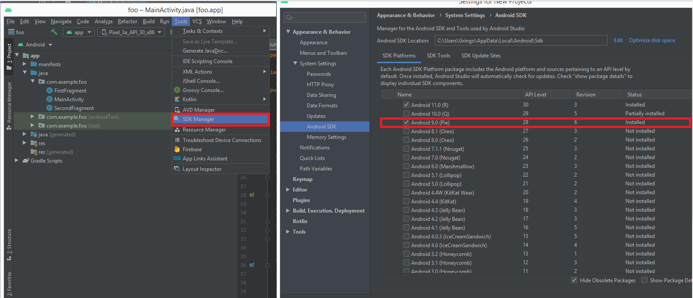

# todo-list

## Creer projet ionic

* Creer un dossier

* Se mettre dans le dossier

* Ouvrir le terminal dans le dossier en tapant *CMD* (exemple: C:\Users\Jodin\Desktop\Construction de Projet)


* Installez le CLI avec un package manager. 
```bash
npm install @ionic/cli
```

* Pour exécuter le CLI de façon locale utiliser npm.
```bash
npx ionic
```

* Vous pouvez créer un projet pour le framework de votre choix disposant d'une 
configuration et intégration du compilateur Cordova.

**WARNING: Tout écrire en minuscule**
```bash
npx ionic start my-name-app
```

*Faite le choix de votre framwork*


*Faite le choix du template*


*Faite le choix du capacitor (NO)*


* Dans la cas d'une installation locale d'Ionic vous devez installer ses dépendances.

```bash
npm install
```

* Pour exécuter votre projet, la commande start est disponible.

```bash
npm start
```

## Creation de component

* Pour créer des components

```bash
npx ng generate component component-name
```

* Pour créer des sous components
```bash
npx ng generate component component-name/sous-component-name
```

## Creation de module

* Pour créer un module
```bash
npx ng generate module
```

* Pour créer un module de routing sans le dossier complet
```bash
npx ng generate module module-name --routing --flat
```

## Ionic build

**Inscrire le dossier environment dans .gitignore (car url et clef d'api)**

* copier ce qu'il y a dans le environnement.ts dans le environnement.prod.ts et vérifier que **production** dans environnement.prod.ts soit a true

* Commencer par 
```bash
npx ionic build
```

* Si aucune erreur continuer avec
```bash
npx ionic build --prod
```

* Dans .gitignore enlever le www

* Dans www, index.html rajouter le "." dans 
```html
<base href="/" />
```

* Pour le voir en mode production dans le navigateur
```bash
cd www
```
```bash
php -S localhost:8000
```

## Android studio

* Télécharger et install android studio pour creer l'emulateur du smartphone.
**Prévoir un café car lourd a télécharger et a installer**

* Créer un nouveau projet et choisir son template


* Configurer son projet (name, emplacement, language)


* Activer le mode developpeur du smartphone


* Pour installer les versions des mobiles


* Vérifier la version de sdk Tools


* Pour installer l'émulateur


* Pour acceder a l'emulateur


* Pour choisir la version de son mobile
**Brancher son mobile**


* Cliquer sur run, le resultat sur le mobile doit être


## PERSONNALISER

* Ouvrir config.xml

* Changer le widget id exemple("io.name.nameProjet")

* Changer le nom, la description, l'email

* Regarder les autorisations que l'on pourrais avoir besoins pour son projet (sms, contact, mail ect...)


* Cet commande recadrera et redimensionnera les images
```bash
npx install cordova-res
```


* Changer le splashScreen et l'icon puis valider avec
```bash
npm cordova-res
```
**L'icon et le splash doit être en png ou en jpeg, l'icon avoir une taille de 1024x1024 et le splash 2732x2732**

## Installer son projet sur son mobile

* Installer cordova
```bash
npm install cordova
```

* La commande final doit être
```bash
npx ionic cordova run android --device
```

* Mais quelque prérequi avant
```bash
npm install -g native-run
```

**La version de java doit être jdk8**
* Mettre les variables d'environment JAVA_HOME


* Mettre le chemin du gradle commencer par aller dans path


* Puis rajouter le gradle


